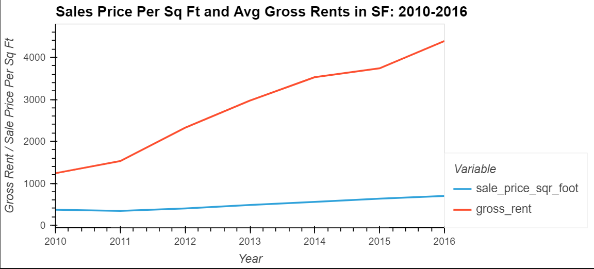
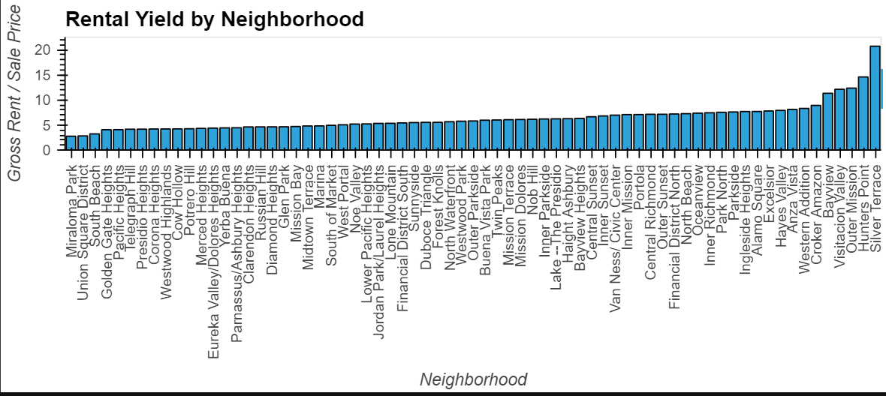
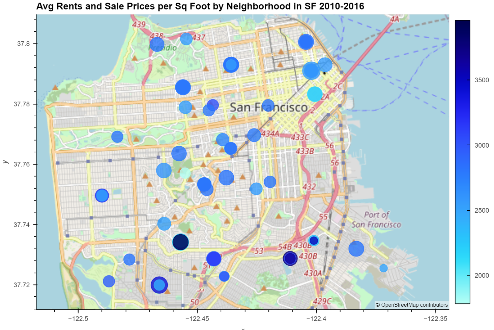

# Real Estate Proptech Analysis

This is a Python-based tool that is helping a proptech company analyze San Francisco real estate.  The analysis includes trends of the SF housing market, specifically comparing rents v. sales prices.  The anlaysis also breaks out numbers by area, providing a template for comparing real estate across neighborhoods.  There is also an interactive neighborhood map and finally a data story providing the relevant analysis for the company.
---

## Technologies

The application is written in Python 3.7 in a Jupyter notebook with support from the following packages:  

*[Pandas] (https://github.com/pandas) - Data analysis

*[Path] (https://github.com/nemec/pathlib) - Import files

*[hvPlot] (https://github.com/hvplot) - Interactive Plotting tools

## Installation Guide

Install hvPlot and Geoviews through the command **conda install -c pyviz hvplot geoviews**

## Usage and Content

To see the analysis, pls clone the repository and open **san_francisco_housing.ipynb** in JupyterLab.  

Here are a few images from the analysis to provide a sample of what can be found:

## Contributors
Vishnu Kurella, vishnu.kurella@gmail.com

## License
VK.LQA 2021